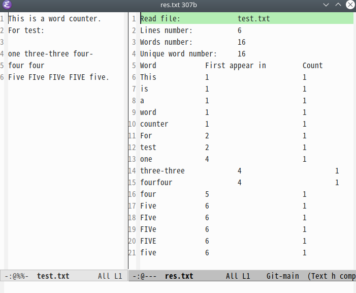

# WordCounter

统计文件的行数，所有单词个数，同时还会记录每个单词首次出现的行数和总共出现的次数。


## 编译

```shell
mkdir build
cmake -S . -B ./build 
make -C ./build
./build/WordCounter
```

## 使用

+ 测试文件 `test.txt` 有如下内容：

```shell
This is a word counter.
For test:

one three-three four-
four four
Five FIve FIVe FIVE five.
```

+ 统计结果

```shell
Read file:		test.txt
Lines number:		6
Words number:		16
Unique word number:	16
Word		First appear in		Count
This		1			1
is		1			1
a		1			1
word		1			1
counter		1			1
For		2			1
test		2			1
one		4			1
threethree		4			1
fourfour		4			1
four		5			1
Five		6			1
FIve		6			1
FIVe		6			1
FIVE		6			1
five		6			1
```
